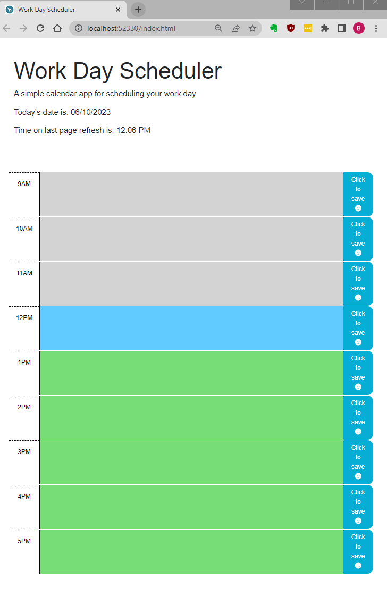

This application features dymaically updated HTML and CSS using jQuery and the Day.js library (https://day.js.org/) for working with dates and times.

Starter code used for this project is here: https://github.com/coding-boot-camp/crispy-octo-meme

Notes:
    Past hours are grey in color
    Current hour is blue
    Future hours are green

    The current time as of last refresh used to calculate pasts/present/future states is shown with today's date

    If the current time is prior to 9am, all timeblock divs are future
    If the current time is after 5pm, all timeblock divs are past
    Otherwise the divs show current hour in blue, past grey and future green.
        
    Click on the the save button to the right of the hour to save that hour's content.
    Saved content will persist in local storage

    To clear an hour: delete all text and click save

